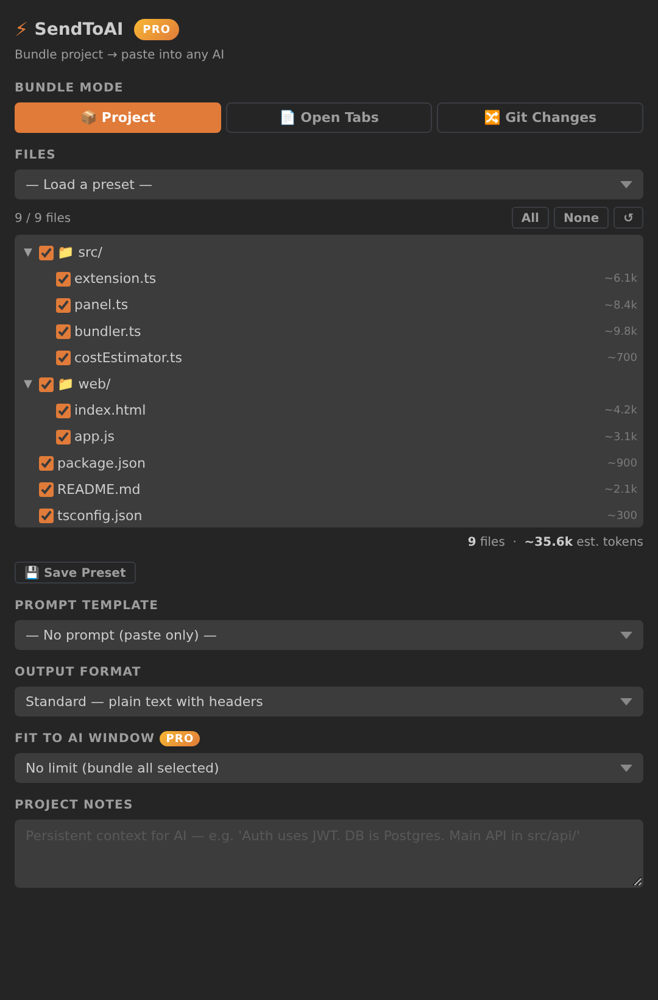

# 🚀 Send to AI — Task-Aware Code Bundling, Round-Trip

**Bundle your errors and the connected code for *any* AI, paste the answer back, apply it — no API key.**




That's the whole loop, inside your editor:

1. **🐛 Bundle Errors** — grab every file VS Code is flagging + the exact error messages.
2. Paste into ChatGPT, Claude, Gemini — whatever you already pay for (or don't).
3. **📥 Apply AI Reply** — paste the answer back; it writes the edits to your files, reviewable and undoable.

No web tool that's free of an API key does this — because no web tool can see your Problems panel or write to your files. That's the editor-native moat.

---

## ✨ What makes it different (v3.8.0)

### 🐛 Bundle Errors — task-aware by construction
One click bundles **only the files VS Code is reporting errors/warnings on**, with the exact diagnostics (`src/api.ts:42:7 [ERROR] Property 'id' does not exist…`) and a ready-to-paste *"please fix these"* prompt. Web bundlers can't read your Problems panel. This can.

> It captures a **snapshot of the Problems panel** as it is right now. If the errors look stale or wrong, save the file or run *"Developer: Reload Window"* / *"Restart Language Server"* so the diagnostics refresh first.

### 📥 Apply AI Reply — the round trip
Copy the AI's response (code blocks labelled with file paths), run the command, and **pick which edits to apply**. Every write is:
- ✅ **Reviewable** — shows up in the editor and in `git diff`
- ✅ **Undoable** — a single `Ctrl+Z`
- ✅ **Safe** — you choose each file; it creates new ones or replaces existing ones

No more hand-copying snippets back block by block.

> **Tip:** copy the AI's *whole* reply, not the chat's per-block "copy code" button — the file path and the ` ``` ` fences must be on the clipboard for the edits to be detected.

### 🎯 Relevance ranking — keep what matters
When a bundle must be trimmed to fit a token window, files are ranked by **relevance to your actual task** — filename/path/content overlap with your prompt, plus structural priors that keep entry points, READMEs and config and demote tests, generated code and lockfiles. Dumb bundlers cut the biggest files; this cuts the *least relevant* ones.

### 🔗 Dependency-graph awareness — connected, not orphaned
A file imported by a relevant file inherits part of that relevance, so the **local dependencies of what you're working on survive the cut alongside it**. Follows relative `import`/`require`/`from` edges in JS/TS and Python. You get complete, connected context — not orphaned snippets.

---

## 💰 Free + Pro ($9 one-time)

Works with **any** AI you already use — it's a companion to your existing chat subscription (or a free one), not a replacement for it. No monthly fee, no API key.

| | Copy-pasting by hand | Web bundler tools | **Send to AI** |
|---|---|---|---|
| **Bundle errors straight from the Problems panel** | ❌ | ❌ can't see your editor | ✅ |
| **Apply the AI's reply back to your files** | hand-copy each block | ❌ | ✅ one command, undoable |
| **Task-aware relevance ranking on trim** | — | biggest-file-first cuts | ✅ keeps what matters |
| **Dependency-graph aware selection** | ❌ | ❌ | ✅ |
| **Your code leaves your machine** | to your AI only | uploaded to their server | to your AI only |
| **Price** | free (your time) | varies | **free · Pro $9 once** |

### 🆓 Free tier
- Single-file send
- Basic project bundling (up to 50 files)
- Standard prompts and ignore patterns
- 🐛 Bundle Errors + 📥 Apply AI Reply

### 💎 Pro tier ($9 lifetime)
- **Unlimited** project bundling
- Advanced token estimation & cost calculation
- 4 output formats (Standard, XML, Compact, Minimal)
- Git integration (bundle only changed files)
- Advanced comment stripping & custom ignore patterns
- Visual file-tree generation
- Priority support

**[🚀 Upgrade — $9 lifetime](https://sendtoai.dev)** · No subscription. Use forever.

---

## 📦 Quick start

1. **Install** the extension — the **SendToAI** icon appears in the activity bar.
2. Open the panel and use the buttons, or right-click a file/folder → **Send to AI**.
3. Paste into your favourite AI chat — then copy its reply and hit **📥 Apply AI Reply**.

### Typical loop
```
🐛 Bundle Errors  →  paste into Claude/ChatGPT  →  copy reply  →  📥 Apply AI Reply  →  Ctrl+Z if you don't like it
```

---

## 🎮 Usage

### Sidebar panel
The fastest path — open the **SendToAI** view and click:
- **🐛 Bundle Errors** — bundle everything with a problem + the messages
- **📥 Apply AI Reply** — apply the AI's code blocks back to your files
- Bundle project, pick output format, set a token window, estimate cost

### Keyboard shortcuts
- `Ctrl+Alt+A` (`Cmd+Alt+A`): Send current file
- `Ctrl+Alt+B` (`Cmd+Alt+B`): Bundle entire project

### Command Palette
`Ctrl+Shift+P` → type **"Send to AI"** → pick any command (including Bundle Errors / Apply AI Response).

---

## ⚙️ Configuration

`File > Preferences > Settings` → search **"Send to AI"**:

```json
{
    "sendtoai.licenseKey": "XXXXXXXX-XXXX-XXXX-XXXX-XXXXXXXXXXXX",
    "sendtoai.autoOpenAI": false
}
```

### Custom ignore patterns
Create a `.sendtoaiignore` in your project root — same syntax as `.gitignore`:

```
# .sendtoaiignore
secrets/**
*.generated.ts
docs/
```

---

## 🤝 Works with every AI

- **ChatGPT** (GPT-4, GPT-4 Turbo, and newer)
- **Claude** (Haiku, Sonnet, Opus)
- **Google Gemini** (Pro, Ultra)
- **Local models** (Ollama, LM Studio)

Output formats include an **XML** mode tuned for Claude and structured analysis, plus **Compact**/**Minimal** for tight token budgets.

---

## 🔒 Privacy & security

- ✅ **Zero data collection** — your code stays on your machine
- ✅ **No telemetry** — all bundling happens locally
- ✅ **0 known vulnerabilities** — dependencies patched and pinned (`npm audit` clean)
- ✅ **Open source** — audit it yourself

---

## 🎯 Perfect for

- 🐛 Fixing a wall of compiler/linter errors in one paste
- 📊 AI code reviews across multiple connected files
- 🔄 Refactoring with full, dependency-aware context
- 🧪 Generating tests from existing code
- 💡 Architecture discussions grounded in the real codebase

---

## 📞 Support

- 🌐 **Website**: [sendtoai.dev](https://sendtoai.dev)
- 🐛 **Found a bug?** [Open an issue](https://github.com/oxainz/sendtoai-vscode/issues)
- 💬 **Need help?** support@sendtoai.dev
- ⭐ **Love it?** [Rate it 5 stars](https://marketplace.visualstudio.com/items?itemName=oxainz.sendtoai&ssr=false#review-details)

## 📄 License

MIT — see [LICENSE](LICENSE).

---

**Bundle your errors + connected code for any AI, paste the answer back, apply it — no API key. Free tier, Pro is a single $9.** 🔧
